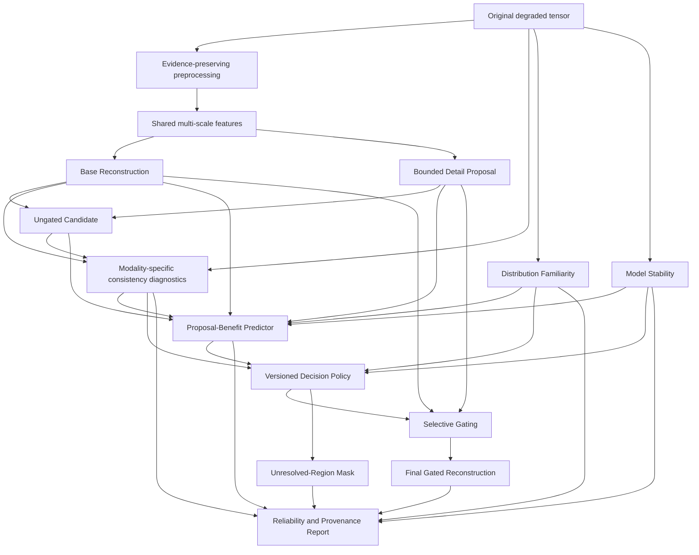

# EVIDENCE-Net Final Idea

## Support-Aware Image Restoration and Validation for Semiconductor-Like Structural Imaging

## 1. Executive Summary

**EVIDENCE-Net** is an image-restoration and validation platform designed for degraded structural images in which a visually convincing reconstruction must not be mistaken for verified physical truth. It addresses inputs affected by mixed degradations such as additive Gaussian noise, signal-dependent or multiplicative noise, blur, down-sampling, clipping, and uncertain operation order. The exact degradation family is configured and validated for the selected imaging modality rather than assumed to be universal.

The system does not return only one polished image. It separates restoration into:

1. **Base Reconstruction**: a lower-intervention, fidelity-oriented estimate that remains independently usable.
2. **Bounded Detail Proposal**: an explicit residual showing what a learned prior wants to add, remove, sharpen, or shift.
3. **Proposal-Benefit Probability**: a calibrated estimate of whether accepting the proposed residual is likely to improve a precisely defined local reconstruction objective relative to the base output.
4. **Measurement-Consistency Diagnostic**: a separate indication of whether the candidate is compatible with a bounded, modality-specific degradation family.
5. **Model-Stability Diagnostic**: a separate indication of sensitivity across perturbations, checkpoints, or genuinely diverse models.
6. **Distribution-Familiarity Diagnostic**: an indication of whether the input resembles the data populations on which restoration and calibration were validated.
7. **Decision Policy**: a versioned rule that accepts, attenuates, rejects, or abstains from proposed detail using the available diagnostics.
8. **Final Gated Reconstruction**: the base output plus only the portion of proposed detail admitted by the decision policy.
9. **Unresolved-Region Mask**: an explicit output for regions where neither the proposal nor the base reconstruction should be treated as sufficiently validated.

The central measurable claim is:

> EVIDENCE-Net separates a lower-intervention reconstruction from an explicit learned-detail proposal, estimates when accepting that proposal is likely to improve a defined outcome, exposes independent consistency, stability, and familiarity diagnostics, and abstains where calibration or identifiability is inadequate.

EVIDENCE-Net does **not** claim that a score proves a reconstructed structure physically existed. Forward consistency is treated as compatibility, model agreement as stability, and calibration as valid only for a named event and population. Every score is stored with its definition, calibration version, spatial unit, target event, and applicable data domain.

The intended mature product combines restoration research, structural-risk evaluation, downstream validation, human review, deployment integrity, and a transparent inspection interface. Its innovation is not merely a new backbone. It is a restoration contract in which model intervention is bounded, visible, separately assessed, selectively admitted, and allowed to abstain.

---

## 2. Problem Statement

Image restoration is fundamentally difficult when degradation removes information. A model can produce a sharp and plausible output by relying on learned regularities even when the observation cannot uniquely determine the missing structure. In semiconductor-like structural imagery, incorrect additions or deletions can resemble real defects, lines, boundaries, holes, bridges, or periodic features.

Conventional restoration systems commonly hide three facts:

- Which output structure was preserved by the base reconstruction.
- Which structure was introduced mainly by the learned prior.
- Where the model has insufficient basis to make a reliable decision.

A single confidence heatmap does not solve this problem if its meaning is vague. Low expected error, physical compatibility, ensemble agreement, and data familiarity are different properties. EVIDENCE-Net therefore avoids collapsing them into one unexplained score.

The platform is built around four principles:

1. **Expose intervention.** Learned detail must be visible as an explicit residual.
2. **Define every prediction.** A probability must name the event it predicts.
3. **Separate diagnostics.** Compatibility, stability, familiarity, and predicted benefit remain distinct.
4. **Allow abstention.** Falling back to the base output is not proof that the base is correct.

---

## 3. Scope and Domain Positioning

### 3.1 Initial positioning

The first validated release targets **semiconductor-like structural imagery** containing fine boundaries, repeated patterns, narrow lines, isolated points, and defect-like structures. It must not be marketed as an industrial semiconductor solution until one concrete imaging modality, acquisition process, and real validation dataset are established.

### 3.2 Modality contract

Each supported modality requires a documented contract containing:

- Image-formation assumptions.
- Sensor and acquisition characteristics.
- Expected degradation sources.
- Sampling and reconstruction pipeline.
- Pixel size and relevant physical scale when available.
- Typical structure and defect classes.
- Target construction and alignment method.
- Permitted decision uses.
- Known non-identifiability cases.
- Acceptable error and abstention policies.

Multiple modalities use separate forward-model versions and may require separate calibration versions. A universal degradation bank is not assumed.

### 3.3 Non-goals

EVIDENCE-Net does not promise:

- Perfect recovery of information destroyed by degradation.
- Zero hallucination.
- Exact identification of the hidden degradation order.
- Physical proof that every accepted detail existed.
- A universally calibrated score across all sensors or datasets.
- Replacement of expert review for high-impact decisions.

---

## 4. Target Users

### Primary user: Imaging and validation engineer

The primary user compares restoration outputs, investigates structural changes, validates model behavior, and decides whether an output can be used in a downstream inspection or measurement workflow.

### Supporting users

- **Computer vision researchers** develop restoration, uncertainty, calibration, and stress-test methods.
- **Semiconductor inspection specialists** define modality assumptions, critical structures, realistic degradations, and downstream consequences.
- **Quality and validation teams** review calibration, source-held-out results, provenance, regression reports, and release criteria.
- **Downstream vision teams** consume restored images for segmentation, anomaly detection, defect detection, or measurement.
- **Platform engineers** deploy validated models and monitor semantic, numerical, and calibration integrity.

The interface is designed for technical review rather than as a decorative AI dashboard.

---

## 5. Core Product Capabilities

### 5.1 Evidence-Preserving Input Pipeline

The pipeline preserves the raw tensor and records data type, numerical range, clipping indicators, dimensions, hashes, and preprocessing version. Derived views may include robust normalization, gradients, local statistics, and frequency components, but they are transformations of the same measurement rather than independent evidence.

Every engineered channel must pass an ablation against pre-declared outcomes. A channel remains only if it improves held-out restoration, proposal-benefit calibration, structural-risk detection, distribution-shift behavior, or downstream performance.

### 5.2 Base Reconstruction Engine

The Base Reconstruction is a complete fidelity-oriented restoration model. It is not automatically called “safe.” Its lower-intervention status must be demonstrated through comparisons such as structural false-positive rate, worst-group performance, local deviation, and downstream risk.

If the branch does not demonstrate a more conservative operating point, the product continues to call it the **Base Reconstruction** and does not imply safety.

### 5.3 Bounded Detail Proposal

The proposal branch predicts a residual instead of another unrestricted full image. The residual is bounded numerically and evaluated structurally.

A numerical amplitude bound alone is insufficient. The platform also records or constrains:

- Multi-scale residual energy.
- Gradient and curvature change.
- Edge displacement.
- Connected-component creation or removal.
- Frequency-band energy.
- Downstream measurement impact when labels exist.

### 5.4 Proposal-Benefit Probability

This is the primary calibrated prediction.

A default patch-level event is:

> Accepting the proposed residual in this patch reduces a pre-defined weighted local loss relative to the Base Reconstruction.

The target loss is versioned and may combine pixel fidelity, edge displacement, false-structure penalties, and task-specific measurement impact. The system never displays a probability without naming the event, spatial unit, calibration population, and calibration version.

### 5.5 Measurement-Consistency Diagnostic

A bounded, modality-specific forward model checks whether a candidate could plausibly reproduce the observation. The result is a compatibility measurement, not proof that the candidate is the true clean image.

The diagnostic reports behavior across plausible operators rather than only the minimum residual. It includes operator assumptions, parameter bounds, misspecification tests, and known non-identifiable examples.

### 5.6 Model-Stability Diagnostic

This diagnostic measures sensitivity across test-time perturbations, checkpoint snapshots, or models with measured error diversity. Agreement is never presented as correctness. The signal is retained only if it adds held-out value after accounting for simpler predictors such as residual magnitude, local signal strength, and distribution familiarity.

### 5.7 Distribution-Familiarity Diagnostic

The system estimates whether an input or region resembles the restoration and calibration populations. The representation, distance method, reference population, and threshold are versioned. An unfamiliar input can trigger stronger attenuation, abstention, or a warning that calibration may not apply.

### 5.8 Decision Policy and Selective Restoration

A versioned Decision Policy converts the diagnostics into one of four actions:

- **Accept** the proposal.
- **Attenuate** the proposal.
- **Reject** the proposal and retain the base estimate.
- **Abstain** and mark the region unresolved.

The policy may be pixel-, patch-, edge-, or task-region aware. It must document threshold choices, costs, critical-region weighting, and applicable calibration domain.

### 5.9 Reliability and Structural-Risk Evaluation Center

The evaluation center includes restoration metrics, calibrated-event reliability, selective-risk analysis, structural-failure localization, ambiguity tests, acquisition-artifact tests, natural model failures, and downstream consequence analysis.

### 5.10 Provenance and Review Package

Every result includes model, data, support-definition, calibration, forward-model, and decision-policy versions. A review package contains all images, diagnostics, warnings, metrics, hashes, and applicable limitations.

---

## 6. Output Contract

For every restoration run, EVIDENCE-Net produces:

- Original input tensor metadata and preview.
- Preprocessing manifest.
- Base Reconstruction.
- Bounded Detail Proposal, including positive and negative components.
- Ungated candidate reconstruction.
- Proposal-Benefit Probability map.
- Measurement-Consistency map and operator summary.
- Model-Stability map where validated.
- Distribution-Familiarity map or indicator.
- Decision-action map: accept, attenuate, reject, abstain.
- Final Gated Reconstruction.
- Unresolved-Region Mask.
- Structural-change summary.
- Applicable calibration and support definitions.
- Failure warnings.
- Reproducibility and provenance report.

The product does not use a context-free global support score. Image-level summaries include distributions, unresolved area, lowest critical-region values, and task-aware risk summaries. Any aggregate is tied to a documented aggregation policy.

---

## 7. User Experience

### 7.1 Restoration Workspace

The main workspace uses synchronized zoom and pan across:

1. Degraded input.
2. Base Reconstruction.
3. Detail Proposal.
4. Ungated candidate.
5. Final Gated Reconstruction.
6. Ground truth when available.

The user can inspect the exact same location across all views.

### 7.2 Intervention Inspector

Positive and negative proposal components are shown independently. Structural summaries indicate edge movement, component changes, and residual energy. This makes model additions and deletions visible rather than hidden inside a full output.

### 7.3 Reliability Layers

The interface provides separate overlays for:

- Proposal-Benefit Probability.
- Measurement Consistency.
- Model Stability.
- Distribution Familiarity.
- Final Decision Action.
- Unresolved Regions.

The UI does not merge these by default into a universal green-to-red trust heatmap. Each legend states what the layer means and does not mean.

### 7.4 Pixel and Patch Inspector

At a selected location, the interface displays:

- Raw and normalized input values.
- Base prediction.
- Proposed residual.
- Ungated and final values.
- Each diagnostic separately.
- Decision action and threshold.
- Ground truth and local error when available.
- Support definition and calibration applicability.

### 7.5 Threshold and Policy Explorer

The user can change an allowed decision threshold and observe how coverage, abstention, and measured risk change. On paired evaluation data, the interface links this interaction to the actual local outcome.

### 7.6 Ambiguity and Failure Viewer

The product includes examples where multiple clean structures generate nearly indistinguishable degraded observations. It also displays verified model failures. This prevents the interface from presenting only curated successes.

### 7.7 Reliability Dashboard

The dashboard separates:

- Discrimination and ranking.
- Probability calibration.
- Selective risk and coverage.
- Restoration improvement.
- Structural false positives and false negatives.
- Worst-group results.
- Distribution-shift behavior.
- Downstream task impact.

Pixel results are grouped statistically by independent image or source group rather than treated as millions of independent observations.

---

## 8. Scientific Definitions

### 8.1 Base and proposal

Let the degraded observation be $y$, the clean target during supervised training be $x$, the Base Reconstruction be $b(y)$, and the bounded detail proposal be $d(y, b)$.

The ungated candidate is:

$$
c = b + d
$$

A simple numerical proposal parameterization is:

$$
d = \alpha \tanh(h_d(f(y), b))
$$

where $\alpha$ is configured for the modality and resolution. Structural controls are evaluated in addition to this amplitude bound.

### 8.2 Proposal-benefit event

For region $r$ and a versioned local utility or loss $L_r$:

$$
z_r = \mathbb{1}[L_r(c, x) < L_r(b, x)]
$$

The Proposal-Benefit Predictor estimates:

$$
p_r = P(z_r = 1 \mid y, b, d, \phi_r)
$$

where $\phi_r$ contains only documented input features and optional diagnostics. The displayed probability refers to this event, not to the claim that a reconstructed feature physically existed.

A soft target may encode the magnitude of improvement, but the exact transformation is versioned.

### 8.3 Decision gate

A versioned policy $\pi$ consumes the proposal-benefit probability and optional diagnostics:

$$
a_r = \pi(p_r, m_r, s_r, q_r)
$$

where:

- $m_r$ is measurement consistency.
- $s_r$ is model stability.
- $q_r$ is distribution familiarity.

The action $a_r$ maps to an acceptance weight $g_r \in [0,1]$ or to abstention.

$$
\hat{x}_r = b_r + g_r d_r
$$

An unresolved mask $u_r$ is produced separately. Rejecting the proposal does not set $u_r$ to false automatically.

### 8.4 Calibration contract

Calibration is defined by:

- Target event.
- Spatial unit.
- Calibration population.
- Grouping hierarchy.
- Calibration method.
- Threshold policy.
- Confidence-interval method.
- Validity limitations.

Ranking quality and calibration quality are reported separately.

---

## 9. Architecture



### Components

- **PyTorch model stack:** reference training and inference.
- **FastAPI service:** validated upload, model execution, artifact retrieval, comparison, stress tests, and reports.
- **React and TypeScript frontend:** synchronized inspection, diagnostics, policy exploration, and reliability charts.
- **PostgreSQL metadata store:** multi-user experiment and production provenance. SQLite may be used for local development.
- **Artifact storage:** local or controlled object storage for tensors, images, reports, checkpoints, and stress-test assets.
- **DVC:** dataset and manifest versioning where it fits the team workflow.
- **MLflow:** experiment, metric, configuration, and artifact tracking.
- **ONNX Runtime and optional TensorRT:** deployment only after semantic and decision parity are validated.
- **Prometheus and Grafana:** production service and model-health monitoring when deployment requires them.

---

## 10. Model Design

### 10.1 Input representation

The mandatory input is the raw corrupted tensor. Candidate derived channels are introduced incrementally:

- Robust normalized view.
- Negative and saturation magnitudes where meaningful.
- Local mean and variance.
- Gradient magnitude.
- Low- and high-frequency components.

A robust view may use:

$$
y_{norm} = \frac{\operatorname{asinh}(y / s)}{k}
$$

The raw tensor remains available. Derived channels are not described as independent evidence.

### 10.2 Base Reconstruction

A strong NAFNet-style or similarly capable encoder-decoder is an initial candidate, not a permanent architectural commitment. It is compared with classical, direct, regularized, and equal-capacity baselines.

$$
b = U(y) + h_b(f(y))
$$

where $U$ is deterministic resizing or reconstruction appropriate to the task.

The Base Reconstruction is trained without an unrestricted adversarial objective in the first validated configuration. Its lower-intervention behavior is measured rather than assumed.

### 10.3 Detail Proposal

The proposal receives shared features and the base output. Its training objective includes fidelity to the target residual and structural-effect controls.

$$
d^* = x - \operatorname{stopgrad}(b)
$$

The branch must demonstrate oracle-gating headroom. If an oracle cannot use the proposal to improve relevant metrics meaningfully, the decomposition is rejected or redesigned.

### 10.4 Proposal-Benefit Predictor

The predictor may receive:

- Base and proposal features.
- Absolute and signed proposal magnitude.
- Local raw-signal statistics.
- Multi-scale structural effects.
- Measurement-consistency features.
- Model-stability features.
- Distribution-familiarity features.

Each evidence family is ablated. The simplest model that meets calibration and selective-risk requirements is preferred.

The predictor first trains separately from the proposal. Joint optimization is allowed only after experiments show that the score retains ranking and calibration meaning rather than becoming an opaque attention map.

### 10.5 Modality-Specific Forward Model

The forward model is bounded and documented. It may contain physically plausible noise, blur, sampling, and operation-order hypotheses for the chosen modality.

It reports compatibility across the operator family, not just the best residual. Counterexamples where incorrect candidates remain consistent are part of validation.

### 10.6 Model Stability

Stability can use:

- Test-time transformations with invertible alignment.
- Checkpoint snapshots.
- Independently trained models.
- Diverse architectures or objectives with measured error diversity.

Same-data agreement is never used as proof of correctness.

### 10.7 Distribution Familiarity

The method may compare documented feature representations with source- and degradation-group reference distributions. It must be evaluated on known shifts and cannot be introduced as a vague “distance from training.”

### 10.8 Abstention

Abstention is triggered when calibration does not apply, familiarity is inadequate, ambiguity remains high, or predicted risk exceeds the configured policy. Future versions may return multiple plausible candidates or intervals for unresolved regions.

---

## 11. Training and Research Workflow

### Phase 1: Domain and Data Foundation

- Select the initial imaging modality or explicitly retain semiconductor-like benchmark positioning.
- Create a formal data card.
- Verify provenance, pairing, dimensions, type, and alignment.
- Quantify reference-target uncertainty.
- Detect duplicates and near duplicates.
- Group by the highest source level that can leak repeated structures.
- Create separate training, validation, calibration, and untouched test sets.
- Reserve source-held-out and degradation-held-out groups.

### Phase 2: Strong Baselines

Train and compare:

- Deterministic or classical reconstruction.
- Strong direct restoration.
- Equal-capacity direct restoration.
- Candidate Base Reconstruction.

Characterize natural failures by structural type, not only aggregate metrics.

### Phase 3: Proposal and Oracle Study

- Train the bounded Detail Proposal.
- Measure ungated benefit and harm.
- Compute oracle pixel- and patch-level gates.
- Evaluate structural and downstream oracle headroom.

**Kill criterion:** if oracle selection provides negligible value over the Base Reconstruction and equal-capacity direct model, redesign or abandon the gated decomposition.

### Phase 4: Proposal-Benefit Prediction

- Define the event and weighted local utility.
- Train the simplest predictor.
- Compare with residual magnitude, local signal-to-noise, and other trivial heuristics.
- Calibrate on a separate calibration set.
- Evaluate ranking, calibration, and selective risk.

### Phase 5: Physical Compatibility

- Build a modality-specific bounded forward family.
- Validate assumptions with real or expert-reviewed acquisition behavior.
- Test operator misspecification.
- Build non-identifiable counterexamples.
- Retain forward features only if they improve held-out prediction or risk control.

### Phase 6: Stability and Shift

- Measure ensemble error diversity.
- Test checkpoint, perturbation, and architectural stability signals.
- Implement and validate distribution familiarity.
- Evaluate under source, severity, operator, and acquisition shift.

### Phase 7: Structural-Risk Program

Build five distinct test suites:

1. **Candidate manipulation:** inject false lines, deletions, edge shifts, merges, splits, and periodic patterns into proposals after training.
2. **Observation ambiguity:** construct differing clean candidates that map to nearly indistinguishable observations.
3. **Acquisition artifacts:** introduce modality-plausible corruption before inference.
4. **Natural failure bank:** collect unedited mistakes from frozen restoration models.
5. **Downstream consequence:** measure changes in detection, segmentation, classification, or metrology.

Final test perturbations and parameter ranges are hidden from support training.

### Phase 8: Decision Policy and Abstention

- Define costs and critical regions with domain experts.
- Compare accept, attenuate, reject, and abstain policies.
- Evaluate coverage versus risk.
- Validate that fallback does not get mislabeled as verified.

### Phase 9: Product and Human Factors

- Build the inspector and Reliability Center.
- Run user studies with imaging and validation engineers.
- Measure interpretation accuracy, review quality, review speed, and over-trust.
- Refine labels and warnings based on observed misunderstandings.

### Phase 10: Deployment Integrity

- Export after score semantics stabilize.
- Validate PyTorch, ONNX, and TensorRT numerical parity.
- Validate ranking, calibration, threshold actions, alignment, and abstention parity.
- Add monitoring and reviewed-case recalibration workflows.

---

## 12. Training Objectives

### Base loss

$$
L_{base} = \lambda_p L_{charb}(b,x)
+ \lambda_s(1-SSIM(b,x))
+ \lambda_e L_{edge}(b,x)
+ \lambda_f L_{freq}(b,x)
$$

These terms remain only if they improve pre-declared outcomes without damaging rare structures.

### Proposal loss

$$
L_{detail} = L_1(d,d^*)
+ \lambda_{ed}L_{edge}(d,d^*)
+ \lambda_m L_{magnitude}(d)
+ \lambda_{struct}L_{structural\ change}(b,d,x)
$$

### Benefit-prediction loss

For a calibrated event target $z_r$:

$$
L_{benefit} = BCE(p_r,z_r) + \lambda_{rank}L_{rank} + \lambda_{cal}L_{calibration}
$$

Spatial smoothing is used only if narrow-risk localization does not degrade.

### Final reconstruction loss

$$
L_{final} = L(\hat{x},x)
$$

Joint fine-tuning is controlled. A separate reconstruction-trained gate baseline determines whether the interpretable predictor is doing more than attention. Calibration is repeated after any joint update.

---

## 13. Dataset and Degradation Program

### Data card requirements

- Dataset source and rights.
- Acquisition method.
- Meaning of the clean target.
- Alignment process and residual uncertainty.
- Bit depth and raw numerical behavior.
- Source grouping hierarchy.
- Structural and defect distribution.
- Known biases and missing cases.
- Real versus synthetic degradation labels.
- Permitted training, evaluation, and display uses.

### Synthetic data policy

Synthetic degradation supports real or independently justified data; it does not silently replace domain validation. Synthetic-to-real comparisons include:

- Intensity-conditioned residual distributions.
- Local mean-variance behavior.
- Residual autocorrelation.
- Frequency attenuation.
- Gradient suppression.
- Clipping and out-of-range behavior.
- Spatially varying severity.

Synthetic evaluation is labeled as such. Calibration on synthetic data is not presented as calibration on real acquisition data.

---

## 14. Evaluation Protocol

### 14.1 Primary endpoints

1. Final reconstruction performance against strong equal-capacity direct restoration.
2. Structural false-positive and false-negative behavior.
3. Selective risk as low-benefit proposals are rejected.
4. Calibration of the named proposal-benefit event.
5. Worst-group behavior across source, structure, and degradation groups.
6. Downstream decision impact where labels exist.

Primary endpoints and acceptance thresholds are declared before final testing.

### 14.2 Secondary diagnostics

- PSNR, SSIM, and MAE.
- Edge displacement.
- Multi-scale structural error.
- Frequency-domain error.
- Risk-coverage area.
- Benefit-score ranking.
- Incorrect-detail localization.
- Familiarity and abstention behavior.
- Parameter count, memory, latency, and throughput.

### 14.3 Statistical discipline

- Independent images or source groups are the statistical units.
- Pixels are not treated as independent experiments.
- Paired comparisons are used for outputs on the same sample.
- Confidence intervals are clustered or bootstrapped by image or source group.
- Model selection, calibration, and final testing remain separate.
- Negative, failed, and inconclusive results are retained.

### 14.4 Baseline matrix

- Classical or deterministic reconstruction.
- Strong direct restoration.
- Equal-capacity direct restoration.
- Base Reconstruction alone.
- Base plus ungated proposal.
- Base plus random gate.
- Base plus shuffled learned gate.
- Base plus residual-magnitude gate.
- Base plus local-signal heuristic gate.
- Base plus reconstruction-trained attention gate.
- Base plus calibrated Proposal-Benefit gate.
- Oracle pixel and patch gates.
- Standard heteroscedastic uncertainty model.
- Deep or heterogeneous ensemble.
- Selective-prediction or abstention method.
- Full model with each diagnostic family removed.

All comparisons control data, split, optimization budget, search effort, and capacity as closely as possible.

### 14.5 Required separation of concepts

- **Fusion utility:** improvement of the final image.
- **Ranking:** ordering of regions by benefit or risk.
- **Calibration:** numerical agreement with event frequency.
- **Compatibility:** agreement with the forward family.
- **Stability:** sensitivity across models or perturbations.
- **Familiarity:** relation to validated data populations.

No metric from one category is used as proof of another.

---

## 15. Acceptance Criteria

EVIDENCE-Net becomes a validated release only if:

- The Base Reconstruction is independently competitive and its claimed lower-intervention behavior is measured.
- The proposal creates meaningful oracle-gating headroom.
- The final policy improves at least one pre-declared primary endpoint without unacceptable regression on the others.
- Proposal-Benefit Probability outperforms trivial heuristics and reconstruction-only attention on held-out data.
- Calibration remains useful within the stated calibration domain.
- Shift and unfamiliarity warnings detect at least the pre-declared validation conditions they are designed for.
- Structural tests include candidate, ambiguity, acquisition, natural-failure, and downstream suites.
- Abstention reduces risk at an acceptable coverage level.
- Each complex diagnostic provides incremental held-out value.
- Deployment transformation preserves decisions, calibration behavior, spatial alignment, and abstention within defined tolerances.
- User testing shows that technical users understand the separate diagnostics and do not systematically treat them as physical proof.

A component that fails its ablation is removed, regardless of implementation effort already spent.

---

## 16. Data Model

### ImageSample

- `sample_id`
- Input and target paths where permitted.
- Dimensions, channels, type, and raw statistics.
- Source-group hierarchy.
- Modality and acquisition identifiers.
- Alignment uncertainty.
- Split and file hash.

### DatasetManifest

- Version and dataset hash.
- Provenance and rights.
- Preprocessing version.
- Grouping and split policy.
- Target-construction method.
- Known limitations.

### ModelVersion

- Model ID and semantic version.
- Checkpoint, configuration, and code hashes.
- Training manifest.
- Runtime format.
- Intended modality and operating domain.

### SupportDefinition

- Definition ID.
- Exact target event.
- Spatial unit.
- Utility or loss function.
- Label-generation version.
- Applicable modality and population.

### CalibrationVersion

- Calibration ID and Support Definition.
- Dataset and grouping.
- Calibration method.
- Confidence-interval method.
- Validity domain and limitations.

### ForwardModelVersion

- Imaging assumptions.
- Operator family and parameter bounds.
- Validation dataset.
- Misspecification tests.
- Known non-identifiability cases.

### DecisionPolicy

- Policy ID.
- Diagnostic inputs.
- Thresholds and combination rule.
- Critical-region weighting.
- Abstention rule.
- Applicable calibration versions.

### RestorationRun

- Run, sample, model, policy, and version IDs.
- Runtime, memory, status, and warnings.
- Aggregate summaries with aggregation-policy ID.

### Artifact

- Input preview, base, detail, candidate, diagnostics, decision map, final, unresolved mask, metrics, and report.
- Path, hash, type, and format.

### MetricRecord

- Metric name and definition version.
- Value and confidence interval.
- Region, source, structure, degradation, and modality groups.

### HumanReviewRecord

- Reviewed region.
- Reviewer decision.
- Disagreement reason.
- Downstream consequence.
- Applicable model and policy versions.

---

## 17. API Design

```text
POST /v1/restorations
GET  /v1/restorations/{run_id}
GET  /v1/restorations/{run_id}/artifacts
GET  /v1/restorations/{run_id}/base
GET  /v1/restorations/{run_id}/detail
GET  /v1/restorations/{run_id}/candidate
GET  /v1/restorations/{run_id}/proposal-benefit
GET  /v1/restorations/{run_id}/measurement-consistency
GET  /v1/restorations/{run_id}/model-stability
GET  /v1/restorations/{run_id}/distribution-familiarity
GET  /v1/restorations/{run_id}/decision-map
GET  /v1/restorations/{run_id}/final
GET  /v1/restorations/{run_id}/unresolved
GET  /v1/restorations/{run_id}/report
POST /v1/comparisons
POST /v1/stress-tests
GET  /v1/support-definitions/{definition_id}
GET  /v1/calibrations/{calibration_id}
GET  /v1/decision-policies/{policy_id}
GET  /v1/model-card
GET  /v1/health
```

Illustrative schema fields use placeholders rather than benchmark-looking numbers:

```json
{
  "run_id": "generated-uuid",
  "model_version": "evidence-net-version",
  "support_definition_id": "proposal-benefit-definition",
  "calibration_version": "calibration-version",
  "decision_policy_id": "decision-policy-version",
  "input": {
    "dtype": "input-dtype",
    "minimum": "measured-at-runtime",
    "maximum": "measured-at-runtime"
  },
  "summaries": {
    "proposal_benefit_distribution": "artifact-reference",
    "unresolved_area": "measured-at-runtime",
    "calibration_applicability": "evaluated-at-runtime"
  },
  "artifacts": {
    "base": "artifact-path",
    "detail": "artifact-path",
    "proposal_benefit": "artifact-path",
    "measurement_consistency": "artifact-path",
    "decision_map": "artifact-path",
    "final": "artifact-path",
    "unresolved": "artifact-path",
    "report": "artifact-path"
  }
}
```

---

## 18. Repository Structure

```text
evidence-net/
├── README.md
├── pyproject.toml
├── Dockerfile
├── docker-compose.yml
├── configs/
│   ├── data/
│   ├── modality/
│   ├── model/
│   ├── support_definition/
│   ├── calibration/
│   ├── decision_policy/
│   └── experiments/
├── src/evidence_net/
│   ├── data/
│   │   ├── datasets.py
│   │   ├── manifests.py
│   │   ├── alignment.py
│   │   ├── preprocessing.py
│   │   └── data_card.py
│   ├── models/
│   │   ├── base_restorer.py
│   │   ├── detail_proposer.py
│   │   ├── benefit_predictor.py
│   │   ├── forward_models.py
│   │   ├── stability.py
│   │   ├── familiarity.py
│   │   └── evidence_net.py
│   ├── decision/
│   │   ├── policies.py
│   │   ├── gating.py
│   │   └── abstention.py
│   ├── losses/
│   │   ├── reconstruction.py
│   │   ├── structural.py
│   │   ├── benefit.py
│   │   └── calibration.py
│   ├── evaluation/
│   │   ├── restoration.py
│   │   ├── calibration.py
│   │   ├── selective_risk.py
│   │   ├── statistics.py
│   │   ├── shift.py
│   │   ├── downstream.py
│   │   └── reports.py
│   ├── stress_tests/
│   │   ├── candidate_manipulation.py
│   │   ├── observation_ambiguity.py
│   │   ├── acquisition_artifacts.py
│   │   ├── natural_failures.py
│   │   └── downstream_consequence.py
│   ├── training/
│   │   ├── stages.py
│   │   ├── trainer.py
│   │   ├── calibration.py
│   │   └── checkpointing.py
│   ├── inference/
│   │   ├── pipeline.py
│   │   ├── tiling.py
│   │   └── export.py
│   └── api/
│       ├── app.py
│       ├── schemas.py
│       └── routes.py
├── frontend/
├── scripts/
├── tests/
│   ├── unit/
│   ├── numerical/
│   ├── integration/
│   ├── calibration/
│   ├── decision_parity/
│   └── regression/
└── docs/
    ├── architecture.md
    ├── model-card.md
    ├── data-card.md
    ├── support-definitions.md
    ├── calibration-card.md
    ├── forward-model-card.md
    ├── decision-policy.md
    └── evaluation-protocol.md
```

---

## 19. Testing Strategy

### Unit tests

- Raw values are preserved.
- Preprocessing is deterministic and versioned.
- Pairing and grouping rules are enforced.
- Residual bounds and structural summaries are correct.
- Gate values remain in range.
- Abstention remains separate from proposal rejection.
- Support definitions link to the correct label generator.
- Forward operators stay within documented bounds.

### Numerical tests

- Gradients remain finite.
- Full and tiled inference remain within tolerance.
- Spatial diagnostic alignment is preserved.
- Mixed precision and exported runtimes preserve ranking and decisions.
- Calibration and abstention thresholds remain within declared parity tolerance.

### Integration tests

- Upload through report retrieval.
- Correct semantic versions are recorded.
- Every run contains required artifacts.
- Stress tests use the intended frozen model and split.
- Calibration dashboards use only permitted data.
- Human review records link to exact outputs.

### Regression tests

A fixed golden set detects:

- Restoration regression.
- Structural false-positive or false-negative regression.
- Calibration regression.
- Selective-risk regression.
- Abstention drift.
- Spatial-map drift.
- Familiarity and shift-detection regression.
- Deployment decision-parity regression.
- Latency and memory regression.

---

## 20. Security, Privacy, and Integrity

- Local-first processing where required.
- No raw-tensor logging by default.
- Strict file-format, dimension, decompression, and type validation.
- Generated internal names rather than trusted upload filenames.
- Encryption in transit and at rest where supported.
- Authenticated and role-aware access for shared deployments.
- Hashes for datasets, checkpoints, policies, reports, and exported models.
- Controlled model formats; avoid untrusted arbitrary pickle loading.
- Pinned dependencies and security scanning.
- Explicit retention and deletion policies.
- Complete provenance from input and support definition to final decision.
- Review audit trail for high-impact outputs.

---

## 21. Monitoring

### Service health

- Request and inference latency.
- Error rate.
- GPU and memory use.
- Artifact-write failures.
- Queue state when queues are enabled.

### Data and model health

- Raw-range and acquisition-statistic drift.
- Distribution-familiarity drift.
- Proposal magnitude and structural-effect drift.
- Action distribution: accept, attenuate, reject, abstain.
- Unresolved-area distribution.

### Reliability health

- Calibration on newly reviewed or paired cases.
- Selective risk at configured coverage.
- Worst-group restoration and structural errors.
- Downstream decision changes.
- PyTorch-to-deployment decision parity.
- Support-definition and policy-version usage.

Score-distribution drift alone is not treated as proof of calibration drift or model failure.

---

## 22. Major Risks and Mitigations

### Ambiguous score semantics

**Risk:** Users treat learned confidence as physical proof.

**Mitigation:** Separate diagnostics, name target events, version semantics, show applicability, and test user interpretation.

### Base output is not actually conservative

**Risk:** The fallback also creates or removes structure.

**Mitigation:** Measure conservativeness explicitly and retain unresolved masks after proposal rejection.

### Bounded residual causes structural damage

**Risk:** Small pixel changes create semantically important structures.

**Mitigation:** Evaluate topology, edges, connected components, measurement, and downstream effects.

### Gate becomes attention

**Risk:** Joint training improves reconstruction but destroys interpretability.

**Mitigation:** Separate two-stage training, freeze tests, external-proposal evaluation, and reconstruction-only attention baselines.

### Forward model explains wrong candidates

**Risk:** Flexible operator selection hides errors.

**Mitigation:** Report operator distributions, penalize flexibility, validate modality assumptions, and include non-identifiable counterexamples.

### Ensemble self-confirmation

**Risk:** Models share biases.

**Mitigation:** Measure error diversity and use agreement only as stability, never truth.

### Synthetic-to-real mismatch

**Risk:** Calibration and performance fail on real acquisition.

**Mitigation:** Label synthetic evidence, compare residual behavior, validate on independent real data, and restrict calibration claims.

### Rare defects become low-familiarity shortcuts

**Risk:** The system suppresses precisely the unusual structures that matter.

**Mitigation:** Evaluate periodic backgrounds, boundaries, rare defects, isolated points, and matched-frequency counterfactuals separately.

### Metric shopping

**Risk:** A large metric suite hides weakness.

**Mitigation:** Pre-declare primary endpoints and release all groups and failure cases.

### Deployment changes decisions

**Risk:** Small numerical differences change thresholds or abstention.

**Mitigation:** Validate semantic and decision parity, not only tensor similarity.

---

## 23. Demo Narrative

1. **Problem:** A restoration can look sharp while some detail comes mainly from the learned prior.
2. **Input:** Show a degraded structural image and its preserved raw statistics.
3. **Base:** Show the Base Reconstruction and state that it is a lower-intervention estimate, not verified truth.
4. **Proposal:** Reveal exactly what the detail branch adds or removes.
5. **Separate diagnostics:** Display predicted proposal benefit, measurement compatibility, model stability, and distribution familiarity independently.
6. **Decision:** Show why each region is accepted, attenuated, rejected, or marked unresolved.
7. **Reliability:** Connect the probability to its exact held-out event definition.
8. **Ambiguity:** Show two plausible clean structures that produce similar observations and demonstrate abstention.
9. **Failure:** Show a case where the system is wrong and how the unresolved or review workflow limits over-trust.
10. **Downstream impact:** Demonstrate whether selective restoration avoids a false defect or harmful measurement change.
11. **Closing:** “EVIDENCE-Net does not certify every reconstructed pixel. It exposes model intervention, predicts when that intervention is likely to help, separates compatibility from confidence, and abstains when the available basis is inadequate.”

---

## 24. Final Product Positioning

EVIDENCE-Net is a **support-aware image-restoration and validation platform**, not a universal truth detector and not merely another restoration backbone.

Its final promise is:

> Restore transparently. Expose learned intervention. Predict its benefit using a named and calibrated event. Show physical compatibility, model stability, and data familiarity separately. Accept detail selectively, and mark unresolved regions when neither output is sufficiently validated.

The system is successful only when it combines:

- Competitive restoration quality.
- Measurable structural-risk reduction.
- Calibrated proposal-benefit prediction.
- Robustness across declared source and degradation shifts.
- Honest abstention.
- Downstream value.
- Correct user interpretation.
- Complete semantic and technical provenance.

The project follows four non-negotiable rules:

1. **Every probability names the exact event it predicts.**
2. **Every complex diagnostic must beat a simpler alternative on held-out data.**
3. **Every claim is bounded by its modality, source, degradation, and calibration domain.**
4. **The interface never presents learned confidence or forward compatibility as physical proof.**

This final design preserves the original insight that restoration should reveal rather than hide prior-driven detail. It strengthens that insight by replacing one ambiguous support map with a complete, testable decision system whose outputs have explicit meanings, whose uncertainty can lead to abstention, and whose scientific claims can be falsified.
